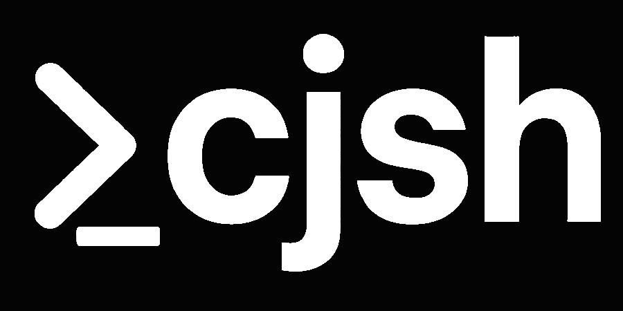

<p align="left">
  
</p>

[](https://ci.appveyor.com/project/CadenFinley/cjsshell/branch/master)


## CJ's Shell

CJ's Shell (cjsh) is a custom login shell with out of the box power. It comes with features like a built in AI assistant who only offers help when you ask for it, a super power plugin engine with a super versitile, language agnostic plugin api, super customizable themes, and a vibrant color engine.

> ⚠️ **WARNING**: This project is still in active development. There are known bugs. Please do not use this unless you are okay with random issues maybe. idk open a pull request or issue if you run into them thanks

## Installation

### Quick Installation

```bash
curl -fsSL https://raw.githubusercontent.com/CadenFinley/CJsShell/master/tool-scripts/cjsh_install.sh | bash
```

To install and set as your default shell:

```bash
curl -fsSL https://raw.githubusercontent.com/CadenFinley/CJsShell/master/tool-scripts/cjsh_install.sh | bash -s -- --set-as-shell
```

### Manual Installation

You can also build and install from source:

```bash
# Clone the repository
git clone https://github.com/CadenFinley/CJsShell.git
cd CJsShell

# Build the project
mkdir build && cd build
cmake ..
make
```

## License

This project is licensed under the MIT License.

## Author

Caden Finley @ Abilene Christian University (c) 2025
