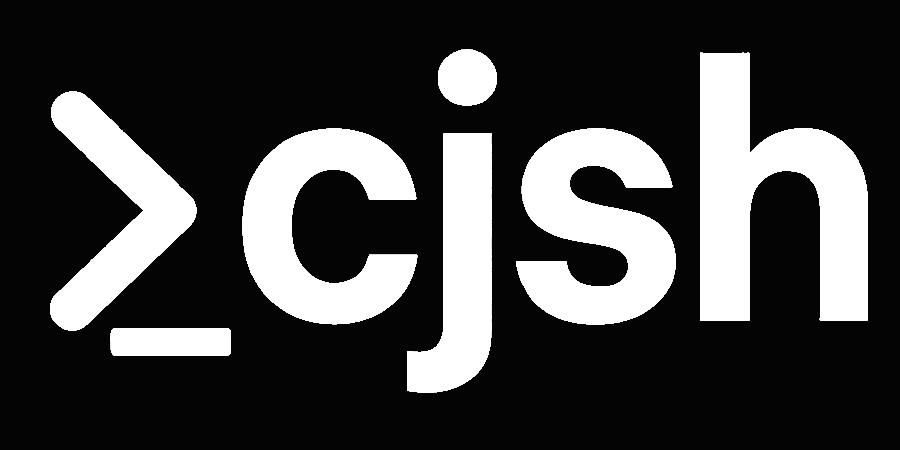

<p align="left">
  
</p>

[](https://ci.appveyor.com/project/CadenFinley/cjsshell/branch/master)


> ⚠️ **WARNING**: This project is still in active development. There are known bugs and issues that are being addressed. Use at your own risk.

## Installation

### Homebrew Installation

```bash
brew install cadenfinley/cjsh/cjsh
```

### Manual Installation

You can also build and install from source:

```bash
# Clone the repository
git clone https://github.com/CadenFinley/CJsShell.git
cd CJsShell

# Build the project
mkdir build && cd build
cmake ..
make
```

## License

This project is licensed under the MIT License.

## Author

Caden Finley @ Abilene Christian University (c) 2025
